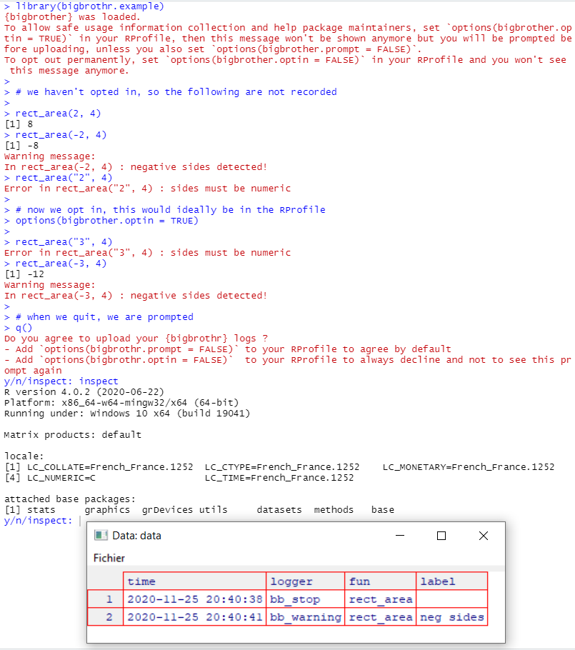

<!-- README.md is generated from README.Rmd. Please edit that file -->

# bigbrothr

*{bigbrothr}* is an experiment on how we might provide automted feedback
to package maintainers on the usage of their package, without bothering
or worrying users nor violating their safety and privacy.

It is only an idea, no data is sent anywhere at the moment.

*{bigbrothr}* should respect safety, privacy, transparency, and
performance, be painless to the user and easy to use for the maintainer,
in that order.

I’m no specialist in either of those areas (at all), barely a curious
explorer.

## Installation

Install with:

``` r
remotes::install_github("moodymudskipper/bigbrothr")
```

## How it works

calls to *{bigbrothr}* functions update global variables in
*{bigbrothr}*’s namespace, when the user quits the session or restarts
it, this data is uploaded to a now inexistent online database.

## opting in our out

*{bigbrothr}* is 100% opt in.

A package that uses *{bigbrothr}* will load its namespace, which will
trigger a message informing that they can: can :

  - opt in by setting `option(bigbrothr.optin = TRUE)`
  - opt out for the session by doing nothing
  - opt out forever and hide future such startup messages by setting
    `option(bigbrothr.optin = FALSE)` in their RPRofile

This is the only annoyance an opt out user will face.

If the user opts out, *{bigbrothr}* functions won’t log any information,
even temporarily.

If the user opts in, when exiting the session and if an internet
connection is detected :

  - The user is asked if it’s ok to send the data
  - They’re offered to inspect the data
  - They’re informed they could have disabled this prompt for the
    session by setting `option(bigbrothr.prompt = FALSE)` and that they
    can disable it forever by adding it to their RProfile.
  - if they accept their data is uploaded.

## Safety, privacy, transparency

No data is kept anywhere between sessions.

*{bigbrothr}* :doesn’t log any sensitive information, it logs things
like:

  - counts of calls to its functions
  - passes, with timestamps
  - execution times
  - edited `SessionInfo()`

The edited `SessionInfo()` doesn’t mention loaded or attached non base
packages.

## functions

At the moment *{bigbrothr}* proposes only drop in replacement for
`message()`, `stop()` and `warning()` : `bb_message()`, `bb_stop()` and
`bb_warning()`.

These have an additional optional `label` argument.

## example

We build an example package, it imports *{bigbrothr}* and contains only
the following code, a function to compute a rectangular area, that fails
explicitly if inputs are not numeric, and warns if they’re negative.

``` r
#' @importFrom bigbrothr bb_stop bb_warning
NULL
#> NULL

#' rectangular area
#'
#' @param x side 1
#' @param y side 2
#' @export
rect_area <- function(x, y) {
  if(!is.numeric(x) || !is.numeric(y))
    bb_stop("sides must be numeric")
  if(x < 0 || y < 0)
    bb_warning("negative sides detected!", label = "neg sides")
  x * y
}
```

We chose to give a label to the `bb_warning` call, not to the `bb_stop`
call.

Now let’s use it :



This example package can be installed using
`remotes::install_github("moodymudskipper/bigbrothr.example")`

## caveat

works only if the session is left using `q()` or `quit()`. Most users
probably quit their session by closing RStudio of restarting the session
from there, which doesn’t work. There might be a way around it.
